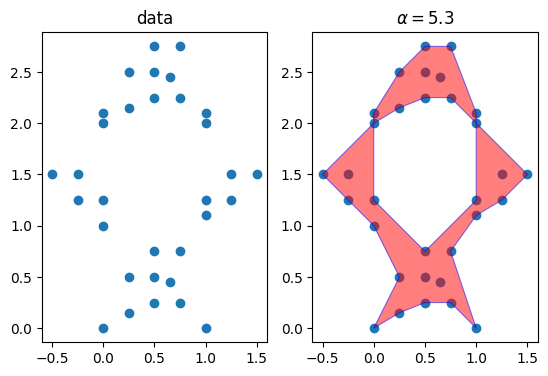
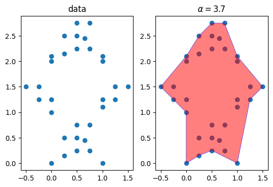
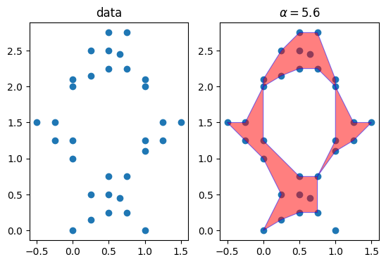
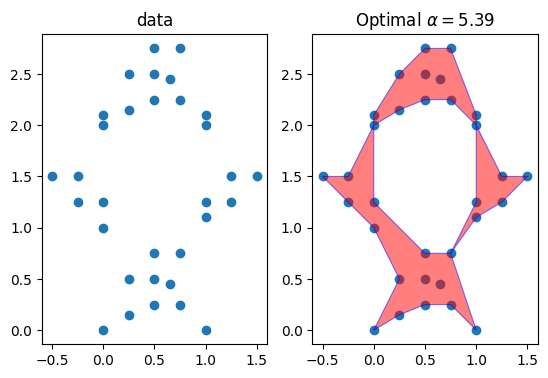
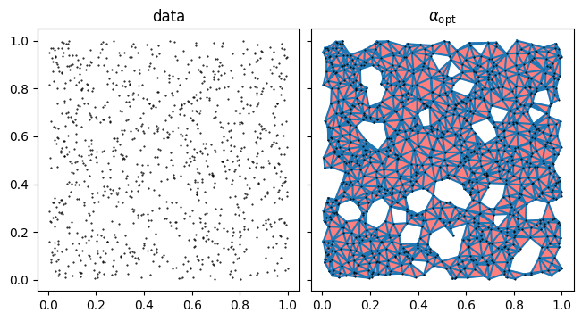

# Alpha Shapes

A Python package for reconstructing the shape of a 2D point cloud on the plane.

## Introduction
Given a finite set of points (or point cloud) in the Euclidean plane, [alpha shapes](https://en.wikipedia.org/wiki/Alpha_shape) are members of a family of closed polygons on the 2D plane associated with the shape of this point cloud. Each alpha shape is associated with a single non negative parameter **α**. 

Intuitively an alpha shape can be conceptualized as follows. Imagine carving out the plane using a cookie scoop of radius 1/**α**, without removing any of the points in the point cloud. The shape that remains **is** the shape of the point cloud. If we replace the arc-like edges, due to the circular rim of the scoop, with straight segments, we are left with the alpha shape of parameter **α**.


Given a finite set of points (or point cloud) in the Euclidean plane, [alpha shapes](https://en.wikipedia.org/wiki/Alpha_shape) are members of a family of closed polygons on the 2D plane associated with the shape of this point cloud. Each alpha shape is associated with a single non negative parameter **α**. 

Intuitively an alpha shape can be conceptualized as follows. Imagine carving out the plane using a cookie scoop of radius 1/**α**, without removing any of the points in the point cloud. The shape that remains **is** the shape of the point cloud. If we replace the arc-like edges, due to the circular rim of the scoop, with straight segments, we are left with the alpha shape of parameter **α**.

## Installation
```console
pip install alpha_shapes
```

## Usage


```python
import matplotlib.pyplot as plt
from alpha_shapes import Alpha_Shaper, plot_alpha_shape
```

Define a set of points. Care must be taken to avoid duplicate points:


```python
points = [(0.,     0.),    (0.,    1.),    (1.,     1.1),
          (1.,     0.),    (0.25,  0.15),  (0.65,   0.45),
          (0.75,   0.75),  (0.5,   0.5),   (0.5,    0.25),
          (0.5,    0.75),  (0.25,  0.5),   (0.75,   0.25),
          (0.,     2.),    (0.,    2.1),   (1.,     2.1),
          (0.5,    2.5),   (-0.5,  1.5),   (-0.25,  1.5),
          (-0.25,  1.25),  (0,     1.25),  (1.5,    1.5),
          (1.25,   1.5),   (1.25,  1.25),  (1,      1.25),
          (1.,    2.),    (0.25,   2.15),
          (0.65,   2.45),  (0.75,  2.75),  (0.5,    2.25),
          (0.5,    2.75),  (0.25,  2.5),   (0.75,   2.25)]
```

Create the alpha shaper


```python
shaper = Alpha_Shaper(points)
```

For the alpha shape to be calculated, the user must choose a value for the `alpha` parameter.
Here, let us set `alpha` to 3.0:


```python
# Calculate the shape
alpha = 5.3
alpha_shape = shaper.get_shape(alpha=alpha)
```

Visualize the result:


```python
fig, (ax0, ax1) = plt.subplots(1, 2)
ax0.scatter(*zip(*points))
ax0.set_title('data')
ax1.scatter(*zip(*points))
plot_alpha_shape(ax1, alpha_shape)
ax1.set_title(f"$\\alpha={alpha:.3}$")

for ax in (ax0, ax1):
    ax.set_aspect('equal')
```


    

    


Good results depend on a successful choise for the value of `alpha`. If for example we choose a sligtly smaller value, e.g. $\alpha = 4.8$:


```python
# Calculate the shape for smaller alpha
alpha = 4.8
alpha_shape = shaper.get_shape(alpha=alpha)

fig, (ax0, ax1) = plt.subplots(1, 2)
ax0.scatter(*zip(*points))
ax0.set_title('data')
ax1.scatter(*zip(*points))
plot_alpha_shape(ax1, alpha_shape)
ax1.set_title(f"$\\alpha={alpha:.3}$")

for ax in (ax0, ax1):
    ax.set_aspect('equal')
```


    

    


We find out that the hole is no longer there.
On the other hand, for larger alpha values, e.g. $\alpha = 5.6$


```python
# Calculate the shape for larger alpha
alpha = 5.6
alpha_shape = shaper.get_shape(alpha=alpha)

fig, (ax0, ax1) = plt.subplots(1, 2)
ax0.scatter(*zip(*points))
ax0.set_title('data')
ax1.scatter(*zip(*points))
plot_alpha_shape(ax1, alpha_shape)
ax1.set_title(f"$\\alpha={alpha:.3}$")

for ax in (ax0, ax1):
    ax.set_aspect('equal')
```


    

    


We find out that mabe we have cut out too much. The point on the bottom right is no longer incuded in the shape

## Features

### Optimization

A satisfactory calculation of the alpha shape requires a successful guess of the alpha parameter. While trial and error might work well in some cases, users can let the `Alpha_Shaper` choose a value for them. That is what the `optimize` method is about. It calculates the largest possible value for `alpha`, so that no points from the point cloud are left out.


```python
alpha_opt, alpha_shape = shaper.optimize()
alpha_opt
```


    5.331459512629298


```python
fig, (ax0, ax1) = plt.subplots(1, 2)
ax0.scatter(*zip(*points))
ax0.set_title('data')
ax1.scatter(*zip(*points))
plot_alpha_shape(ax1, alpha_shape)
ax1.set_title(f"Optimal $\\alpha={alpha_opt:.3}$")

for ax in (ax0, ax1):
    ax.set_aspect('equal')
```


    

    


The optimize method runs efficiently for relatively large point clouds. Here we calculate the optimal alpha shape of an ensemble of 1000 random points uniformly distributed on the unit square.  


```python
from time import time
import numpy as np


#  Define a set of random points
points = np.random.random((1000, 2))
# Prepare the shaper
alpha_shaper = Alpha_Shaper(points)

# Estimate the optimal alpha value and calculate the corresponding shape
ts = time()
alpha_opt, alpha_shape = alpha_shaper.optimize()
te = time()
print(f'optimization took: {te-ts:.2} sec')

fig, axs = plt.subplots(1,
                        2,
                        sharey=True,
                        sharex=True,
                        constrained_layout=True)

for ax in axs:
    ax.plot(*zip(*points),
            linestyle='',
            color='k',
            marker='.',
            markersize=1)

    ax.set_aspect('equal')

_ = axs[0].set_title('data')

plot_alpha_shape(axs[1], alpha_shape)
axs[1].triplot(alpha_shaper)
_ = axs[1].set_title(r'$\alpha_{\mathrm{opt}}$')


```

    optimization took: 0.085 sec


    

    


```python

```
